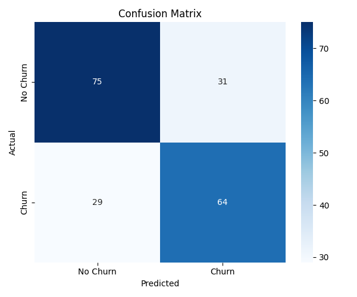

# 💳 Credit Card Churn Analysis

A machine learning project to predict customer churn in a banking system based on behavioral and financial features. Built using **Python**, **Flask**, **MySQL**, and various data science libraries.

---

## 🎯 Problem Statement

Customer retention is a major focus in the banking sector. Predicting customer churn helps institutions take preventive actions.  
This project builds a **churn prediction model** using demographic and transactional data.

---

## 🧠 Objectives

- ✅ Build a machine learning model to classify customer churn.
- ✅ Create an interactive web interface using Flask.
- ✅ Store predictions and user inputs in a MySQL database.

---

## 🔧 Feature Engineering

- **Missing Values Handling:**
  - `Gender`: Mode
  - `Age`: Mean
  - `Tenure`: Median
  - `Balance`: Mean
  - `NumOfProducts`, `HasCrCard`, `IsActiveMember`, `Churn`: Mode

- **Derived Features:**
  - `BalanceToSalaryRatio`
  - `TenureProductRatio`
  - `IsHighBalance` (1 if `Balance > Salary`, else 0)

- **Encoding & Scaling:**
  - One-hot encoding for `Gender`
  - Normalization using `MinMaxScaler`

---

## 📦 Tech Stack

| Component         | Stack                        |
|------------------|------------------------------|
| Language         | Python                       |
| ML Library       | scikit-learn                 |
| Data Processing  | pandas, seaborn, matplotlib  |
| Web Framework    | Flask                        |
| Database         | MySQL                        |
| Version Control  | Git & GitHub                 |

---

## 🤖 Model

- **Algorithm:** Random Forest Classifier  
- **Hyperparameters:**
  - `n_estimators`: 100
  - `class_weight`: balanced
  - `max_depth`: 10
  - `min_samples_split`: 2
  - `min_samples_leaf`: 1

- **Performance Metrics:**
  - 🎯 Accuracy: `0.70`
  - 🎯 Precision: `0.67`
  - 🎯 Recall: `0.69`
  - 🎯 F1-score: `0.68`

- **Top 3 Features:**
  - `Balance`
  - `EstimatedSalary`
  - `Age`

- **Confusion Matrix:**
  

---

## 🌐 Deployment

- **Frontend:** HTML form via Flask
- **Backend:** Predicts using trained model and stores in MySQL
- **Prediction Flow:**
  1. User fills form
  2. Input is preprocessed & passed to model
  3. Prediction displayed on screen
  4. Data logged into MySQL database

---

## 🚀 Future Enhancements

- ☁️ Host the app on **AWS EC2**
- 🗄️ Use **AWS RDS** for MySQL backend
- 📦 Dockerize the web application
- 🔁 Integrate **CI/CD pipelines** with GitHub Actions
- 🔐 Add authentication for user dashboards

---

## 👤 Author

- **Name:** Anand Batchala  
- **Email:** anandvihari150@gmail.com  
- **GitHub:** [@anandbatchala](https://github.com/anandbatchala)

---

## 🪪 License

This project is licensed under the **MIT License**.
